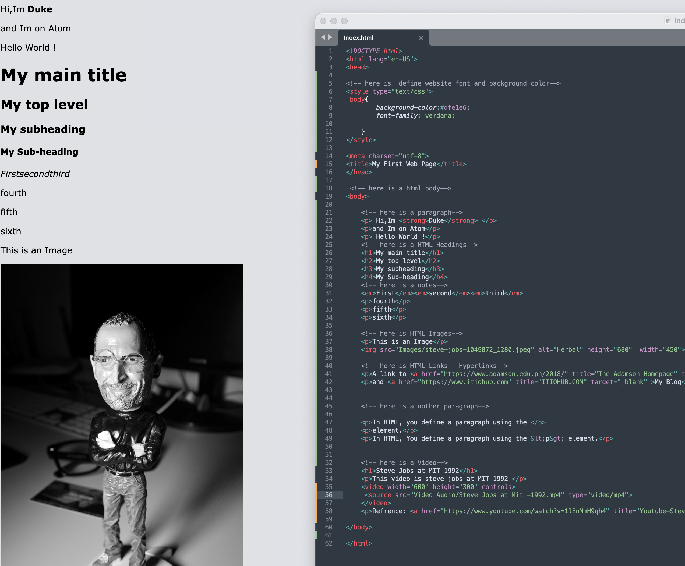
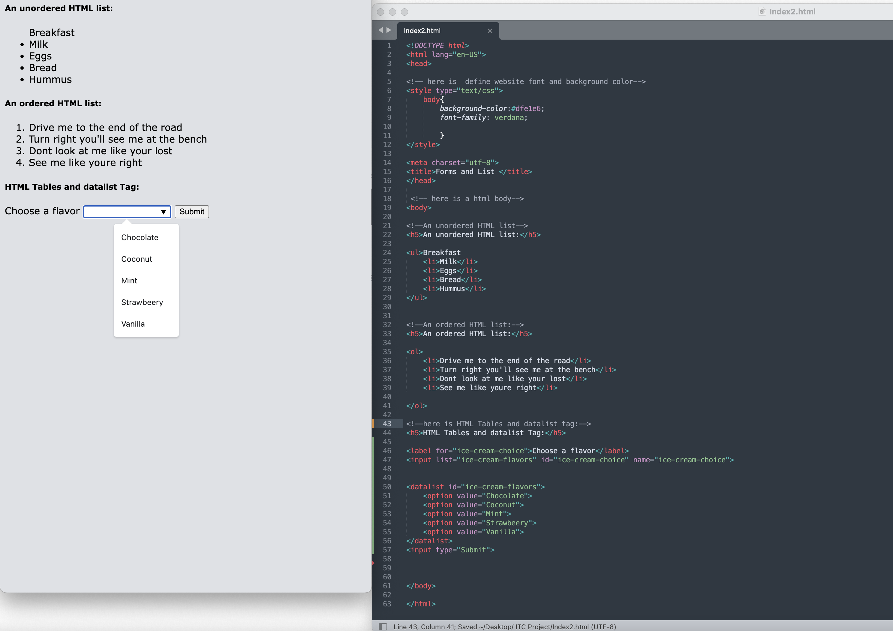
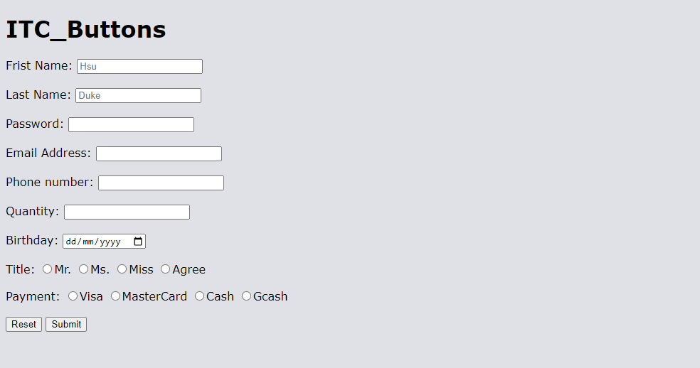

# BSIT_ITC_Coures
ITC Project
### Project NAME:  Module6-8 Fundamentals of HTML 

In this claas. We parctice HTML 

Below image is my code and output

#### Activity1 (code+output)
 

#### Activity 2
 

#### Button Output

